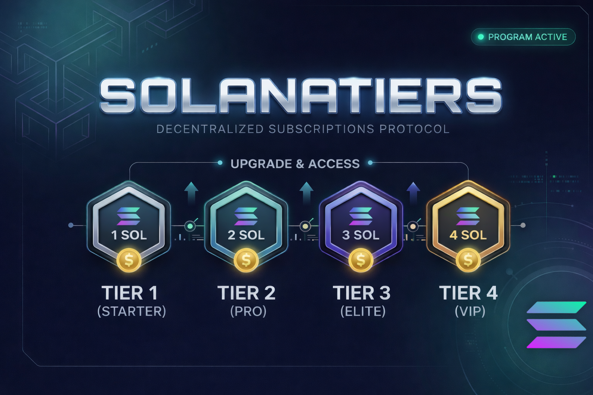
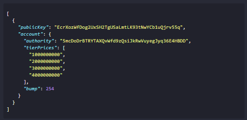
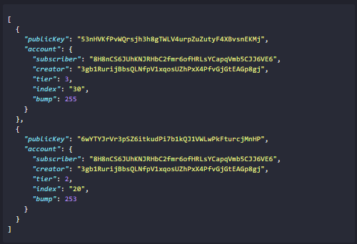

  # 🚀 SolanaTiers — Protocolo de Suscripciones Descentralizadas



**SolanaTiers** es un programa on-chain desarrollado en **Rust** con el framework **Anchor**. Permite a creadores de contenido monetizar su trabajo mediante un sistema de niveles (tiers) de acceso, donde cada suscripción es una **PDA (Program Derived Address)** única y segura.

## 📌 Funcionalidades Principales

El programa implementa un ciclo de vida completo (CRUD) para la economía de creadores:

* **Configuración de Creador:** Inicializa precios personalizados para 4 niveles de suscripción.
  Copia este array para configurar precios de 1, 2, 3 y 4 SOL respectivamente:

```json
[1000000000, 2000000000, 3000000000, 4000000000]
```



* **Suscripciones Dinámicas:** Los usuarios pueden tener múltiples suscripciones a un mismo creador diferenciadas por un `index`.



* **Upgrade Inteligente:** Permite subir de nivel pagando únicamente la diferencia (pro-rateo) entre el tier actual y el nuevo.
* **Gestión de Renta:** Cierre de cuentas con devolución automática de SOL (rent-exempt) al suscriptor o al creador.
* **Auditoría On-Chain:** Sistema de verificación de acceso mediante logs para validar permisos en tiempo real.

---

## 🏗️ Arquitectura de Datos


### PDAs (Program Derived Addresses)

| Cuenta | Semillas (Seeds) | Descripción |
| :--- | :--- | :--- |
| **CreatorConfig** | `["creator", authority_pubkey]` | Almacena precios y la wallet de cobro del creador. |
| **UserSubscription** | `["user", user_pubkey, creator_pubkey, index]` | Almacena el tier actual y los metadatos del suscriptor. |

---

## ⚙️ Instrucciones del Programa

### 1. Gestión del Creador
* **`initialize_creator(tier_prices)`**: Establece los precios para los Tiers 1, 2 y 3 (el índice 0 del array es el precio base).
* **`delete_creator_config()`**: Cierra la cuenta de configuración y recupera el SOL depositado en la renta. Solo el `authority` puede ejecutarlo.

### 2. Ciclo del Suscriptor
* **`subscribe(tier, index)`**: Crea una nueva suscripción. Realiza una transferencia de SOL nativo desde el suscriptor directamente a la wallet del creador.
* **`upgrade_tier(new_tier, index)`**: Verifica que el nuevo tier sea superior al actual, calcula la diferencia de precio y procesa el pago adicional.
* **`cancel_subscription(index)`**: El usuario puede dar de baja su suscripción en cualquier momento, eliminando la PDA y recuperando su SOL de renta.

### 3. Seguridad y Acceso
* **`check_access(required_tier)`**: Compara el tier de la cuenta con el requisito solicitado. Devuelve un booleano y emite un log detallado del estado de la suscripción.

---

## 🔐 Lógica de Validación (Seguridad)

El programa incluye guardias de seguridad para proteger los fondos y la integridad de los datos:

* **Constraint `has_one`**: Garantiza que solo el suscriptor original pueda modificar o cancelar su propia suscripción.
* **Validación de Tier**: Evita suscripciones a niveles inexistentes (Tier 0 bloqueado) o intentos de bajar de categoría (Downgrades) sin la lógica correspondiente.
* **Cálculo de Diferencial**: Protege al creador asegurando que los Upgrades siempre completen el pago del valor total del nuevo nivel.

---
